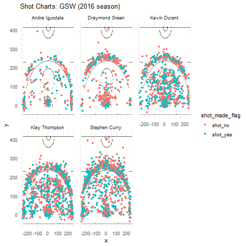

```{r setup, include=FALSE}
knitr::opts_chunk$set(echo = TRUE)

```


```{r, eval = F, echo = FALSE}

echo "* Team Name: Name of the Team (Character)
* Game Date: Date the game was played (Numeric)
* Season: Season of Game (Numeric)
* Period: What period, out of the 4, is the game played at (Numeric)
* Minutes Remaining: How many minutes of the game were remaining (Numeric)
* Seconds Remaining: How many seconds of the game were remaining (Numeric)
* Shot Made Flag: Indicates whether a shot was made or missed (Factor)
* Action Type:  Has to do with the basketball moves used by players, either to pass by defenders to gain access to the basket, or to get a clean pass to a teammate to score a two pointer or three pointer (Character)
* Shot Type: Type of shot being made (Character)
* Shot Distance: Distance to the basket (measured in feet) (Numeric)
* Opponent: Who the team was playing against (character)
* x and y: Coordinates where a shot occured." >> data-dictionary.md

```

# *Oakland News* 
## Shooting Stats of the GSW

###Images
```{r out.width= '80%', echo = FALSE, fig.align = 'center'}

```

####Stephen Curry


####Draymond Green


####Kevin Durant


####Andre Iguodala


####Klay Thompson


```{r, echo = FALSE}
library('dplyr')
shots_data <- read.csv('../data/shots-data.csv')

shots_2PTS <- shots_data %>% select(Name, shot_made_flag, shot_type) %>%
  filter(shot_type == "2PT Field Goal") %>%
  mutate(successful = shot_made_flag == "shot_yes", unsuccessful = shot_made_flag == "shot_no") %>% 
  group_by(Name) %>%
  summarise(Made = sum(successful), Missed = sum(unsuccessful), Total = sum(Made + Missed), Perc_Made = Made/Total) %>%
  select(Name,Total, Made, Perc_Made) %>%
  arrange(desc(Perc_Made))

shots_3PTS <- shots_data %>% select(Name, shot_made_flag, shot_type) %>%
  filter(shot_type == "3PT Field Goal") %>%
  mutate(successful = shot_made_flag == "shot_yes", unsuccessful = shot_made_flag == "shot_no") %>% 
  group_by(Name) %>%
  summarise(Made = sum(successful), Missed = sum(unsuccessful), Total = sum(Made + Missed), Perc_Made = Made/Total) %>%
  select(Name,Total, Made, Perc_Made) %>%
  arrange(desc(Perc_Made))

shots_total <- shots_data %>% select(Name, shot_made_flag, shot_type) %>%
  mutate(successful = shot_made_flag == "shot_yes", unsuccessful = shot_made_flag == "shot_no") %>% 
  group_by(Name) %>%
  summarise(Made = sum(successful), Missed = sum(unsuccessful), Total = sum(Made + Missed), Perc_Made = Made/Total) %>%
  select(Name,Total, Made, Perc_Made) %>% arrange(desc(Perc_Made))
```

###2 Pointers 
```{r, echo = F}
shots_2PTS
```

###3 Pointers
```{r, echo = F}
shots_3PTS
```

###Total Shots
```{r, echo = F}
shots_total
```

####Introduction

This report primarily concerns five of the Golden State Warriors players and analyses their shooting style, with both graphical as well as tabular visualizations. The player being analyzed are Stephen Curry, Draymond Green, Andre Iguodala, Kevin Durant and Klay Thompson, and the statistics being aggregated are their 2-pointers, 3-pointers and then just total shots made, as well as their respective success rates. All data, including the graphical representation, will be referenced in this article and is available for your viewing at the top of this report. All the data analyzed here concerns numbers from the 2016 season which was, all things considered, a pretty good season for Warriors where they only lost by 4 point.

####Motivation

This project was primarily motivated by a need to undergo the general data analysis cycle; this report is designed to illustrate the process of data preparation, core analyses and reporting, wherein this report is the latter part of the cycle. In my opinion it is important to incorporate all these aspects when undertaking a project to truly appreciate the ultimate results, and to be a better prepared data scientist.

####Background

This data can be viewed as the product of my own personal passion for basketball and my devotion to the Warriors as a result of living in the Bay, alongside a need to deliver the best quality of data to my company and you, my readers.

####Data

The data in this report was largely collected from statistics that are available online on various websites about a wide range of attributes for every NBA player. The data that I was focusing on was the effective shooting percentage, per shot type, of five of the higher scoring Warriors players. These data can be seen above in the tables: '2 Pointers', '3 Pointers' and 'Total Shots'.

####Analysis and Discussion

First let's look at the 2 Pointers table. The most obvious thing here is that, despite having the lowest number of 2 pointers, Andre Iguodala has the highest percentage of making these shots, at 63.8% of them made. These shots with include any shot made within the three-point line that is not a rebound, including layups. Almost just as impressive however is Kevin Durant's stats, where he boasts more than three times as many shots as Andre but almost just as high of a success rate, at 60.6% of total shots being made. Curry, Klay and Draymond follow with 53%, 51% and 49% of 2PTS being made, which is just as impressive of a statistic because that means on average between all these players, half of all their shots go into the basket.  

Moving on to three pointers, there is a stark difference in the rankings of the players, with Klay Thompson commanding with 42% of shots being made at 580 total shots, followed closely by Stephen Curry with 687 shots at 41% being made. These statistics are quite remarkable too because both these success rates are not too far off from their 2PT success rate, which means both these players appear very well rounded and are a threat on all aspects of the court. Durant, Andre and Draymond follow these data with 38%, 36% and 32% of successful three pointers, but far less shots being made (less than 300).  

Overall, Kevin Durant leads the charge with 915 total shots being made out of which 54% go through, followed by Andre Iguodala with 371 shots at 51.7% success rate and then Klay, Curry and Draymond with total shots and success rates of 1220/47%, 1250/47% and 578/42% respectively. Overall, Kevin Durant thus appears the biggest threat on the court in terms of offensive ability. 

####Conclusion

These data are a testament to the Warriors dominance in the NBA 2016 season, where they broke a drought of losses to make it all the way to the Finals, only to lose by just a few points to the Cleveland Cavaliers. I would say that the data being presented here is necessary to properly analyze the effectiveness of the GSW, but that it is not the sole piece of data that one should rely on. For example, we could also be looking at the defensive side of the team, by analyzing their blocks, turnovers and interceptions per game or per unit of time. This would paint a broader picture of the team overall as well as the overall effectiveness of each individual player. Ultimately, in the core analysis portion, it is important to have as much data as possible to make relevant conclusions, but also to only focus on what can be gleaned by a certain set of data and not extrapolate anything that can't be validated from this data available.  

_Achintya Suden, Oakland News_

####References

https://www.goldenstateofmind.com/2018/2/21/17010344/2018-nba-golden-state-warriors-steph-curry-efficiency-deep-threes-layups
https://www.nba.com/playoffs/2016/finals/
https://www.basketball-reference.com/teams/GSW/2016.html

